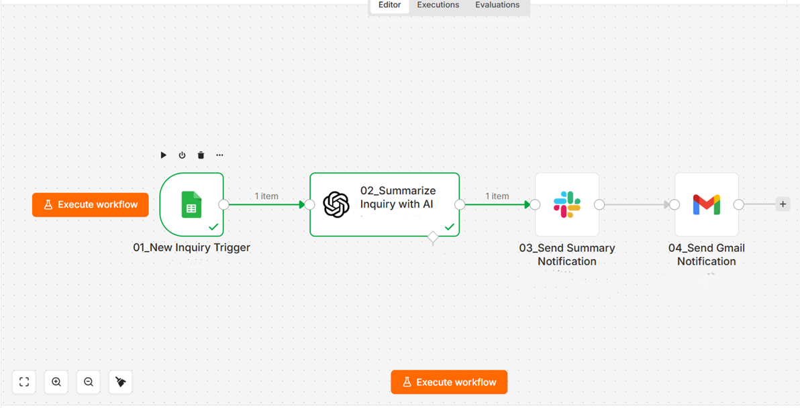
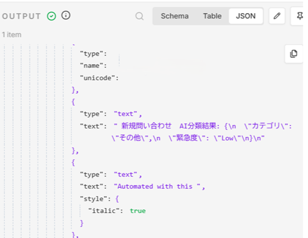
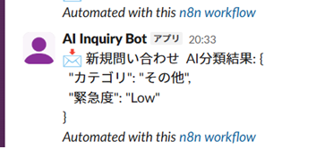

# AI Inquiry Classification Workflow

AI-powered workflow automation using n8n, OpenAI API, Google Sheets, Slack, and Gmail.

## Overview

This project is an AI-powered workflow automation system built with n8n, OpenAI API, Google Sheets, Slack, and Gmail.

Automatically classifies customer inquiries and routes important notifications to Slack and Gmail.

---

## Workflow

Google Forms  
↓  
Google Sheets  
↓  
n8n Trigger  
↓  
OpenAI API  
↓  
AI Classification  
↓  
Slack Notification  
↓  
Gmail Notification

---

## Features

- Automatic inquiry classification
- AI-based urgency detection
- Slack notification automation
- Gmail notification automation
- JSON-formatted AI output
- Faster inquiry handling workflow

---

## Tech Stack

- n8n
- OpenAI API
- Google Sheets
- Google Forms
- Slack
- Gmail

---

## Screenshots

### Workflow Overview

### AI Classification Output

### Slack Notification

---

## Before / After

### Before

- Manual inquiry checking
- Manual urgency judgment
- No automatic notifications
- Slow response workflow

### After

- AI automatically classifies inquiries
- Automatic urgency detection
- Slack notification automation
- Faster inquiry handling workflow

---

## Future Improvements

- Automatic ticket assignment
- CRM integration
- AI-generated reply suggestions
- Advanced sentiment analysis
- Priority-based routing
